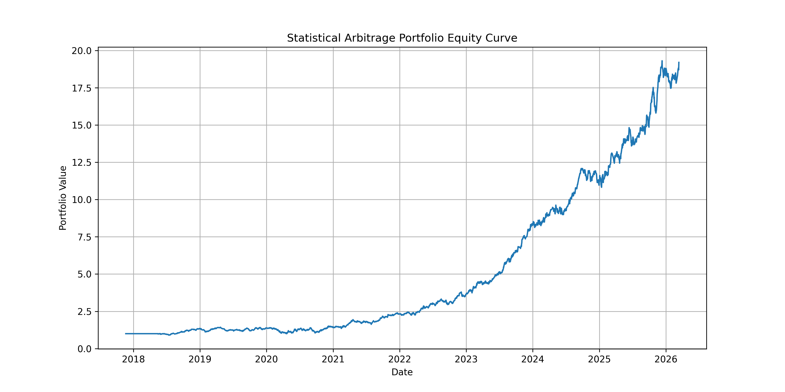
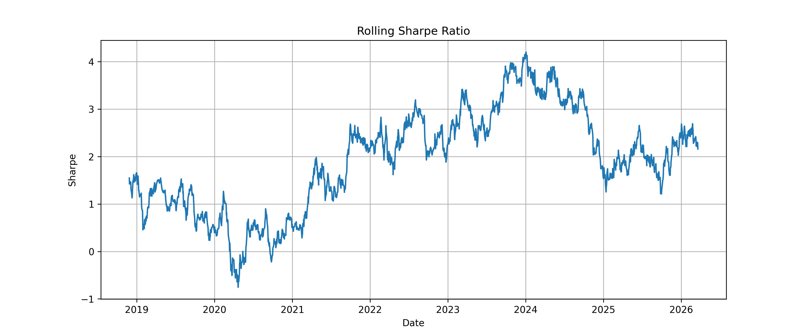
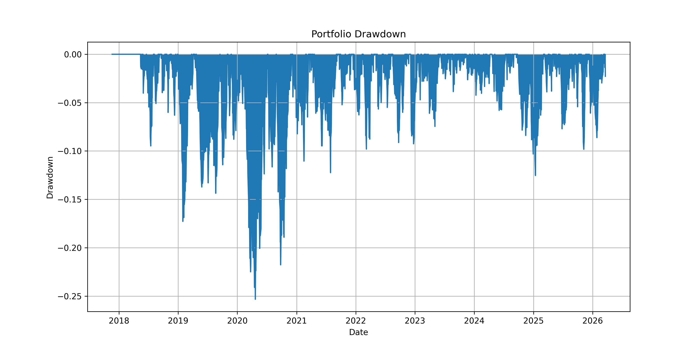

# Statistical Arbitrage Strategy using Pairs Trading (NIFTY 50)

This project implements a statistical arbitrage strategy based on cointegration and mean reversion using stocks from the NIFTY 50 index.

The strategy identifies cointegrated stock pairs, constructs spreads using hedge ratios estimated via regression, generates trading signals using Z-score thresholds, and evaluates portfolio performance through backtesting.

# Project Overview

Statistical arbitrage exploits temporary mispricing between historically related assets.

This project implements a complete quantitative research pipeline:

1. Collect historical price data for NIFTY 50 stocks
2. Identify highly correlated pairs
3. Perform Engle–Granger cointegration tests
4. Estimate hedge ratios using OLS regression
5. Construct mean-reverting spreads
6. Generate trading signals using Z-score thresholds
7. Backtest trading strategies with transaction costs
8. Build a multi-pair portfolio strategy
9. Evaluate risk-adjusted performance metrics
10. Perform advanced mean-reversion diagnostics

# Strategy Results

# Strategy Performance Metrics

| Metric | Value |
|------|------|
| Annual Return | 39.1 % |
| Annual Volatility | 23.9 % |
| Sharpe Ratio | 1.43 |
| Sortino Ratio | 2.57 |
| Maximum Drawdown | -30.4 % |
| Calmar Ratio | 1.29 |

# Project Structure

statistical-arbitrage-pairs-trading
│
├ notebooks
│   01_data_collection.ipynb
│   02_correlation_analysis.ipynb
│   03_cointegration_test.ipynb
│   04_spread_zscore.ipynb
│   05_backtesting.ipynb
│   06_auto_pairs_selection.ipynb
│   07_multi_pair_backtest.ipynb
│   08_pair_performance.ipynb
│   09_strategy_analysis.ipynb
│   10_advanced_analysis.ipynb
│
├ data
│   ├ raw
│   └ processed
│
├ reports
│   equity_curve.png
│   rolling_sharpe_ratio.png
│   portfolio_drawdown.png
│   pair_profit_distribution.png
│   spread_series.png
│   zscore_trading_signal.png
│   zscore_trading_zones.png
│   strategy_vs_nifty.png
│   strategy_equity_curve.png
│
├ strategy_report.md
├ README.md
└ LICENSE

# Strategy Workflow

Price Data
   ↓
Correlation Analysis
   ↓
Cointegration Test
   ↓
Spread Construction
   ↓
Z-Score Signal Generation
   ↓
Backtesting
   ↓
Performance Analysis

# Methodology

 ## Cointegration Testing

The Engle–Granger cointegration test is used to identify stock pairs whose price relationship is stable over time.

If two assets are cointegrated, their spread is expected to revert to a long-term equilibrium, making them suitable for pairs trading.

 ## Hedge Ratio Estimation

The hedge ratio between two assets is estimated using Ordinary Least Squares (OLS) regression.

Spread construction:

spread = S1 − βS2

Where:

- S1 = price of stock 1
- S2 = price of stock 2
- β = hedge ratio estimated using regression

 ## Z-Score Trading Strategy

Trading signals are generated using the Z-score of the spread:

Z = (spread − mean) / std

Trading rules:

Signal| Condition
Long Spread| Z < −2
Short Spread| Z > 2
Exit Position| Z → 0

 ## Portfolio Backtesting

Multiple cointegrated pairs are traded simultaneously to construct a diversified statistical arbitrage portfolio.

Performance metrics evaluated include:

- Total Return
- Annualized Return
- Volatility
- Sharpe Ratio
- Maximum Drawdown
- Calmar Ratio

 ## Strategy Performance

The strategy performance is compared with the NIFTY 50 benchmark.

Key visualizations generated:

- Portfolio equity curve
- Strategy vs benchmark comparison
- Rolling Sharpe ratio
- Portfolio drawdown
- Pair profitability distribution
- Spread behavior analysis
- Z-score trading signals

These plots are saved in the reports/ directory.

 ## Advanced Mean Reversion Diagnostics

Additional diagnostics are performed on selected cointegrated pairs:

- Spread visualization
- Z-score trading zones
- Mean reversion signal analysis
- Half-life estimation of mean reversion

Half-life estimation measures how quickly the spread reverts to equilibrium.

# Technologies Used

Python
Pandas
NumPy
Matplotlib
Statsmodels
yfinance

# Installation

bash
pip install -r requirements.txt

# Key Quantitative Concepts

Statistical Arbitrage
Pairs Trading
Cointegration
Mean Reversion
Portfolio Backtesting
Risk Metrics

# Disclaimer

This project is for educational and research purposes only and does not constitute financial advice.